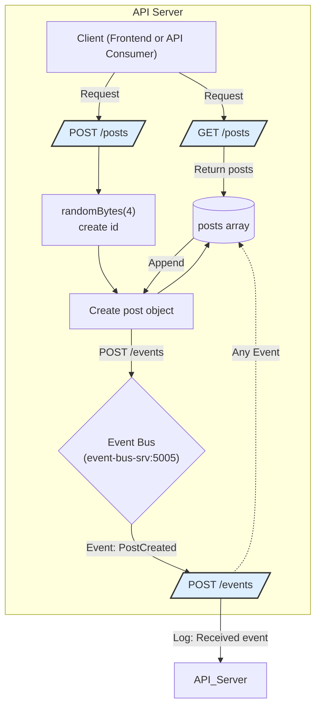

<SwmSnippet path="/posts/index.js" line="32">

---

The posts service is a microservice that has two functionalities: create new<SwmToken path="/posts/index.js" pos="36:2:2" line-data="app.post(&#39;/posts/create&#39;, async (req, res) =&gt; {">`post`</SwmToken> and<SwmToken path="/posts/index.js" pos="32:2:2" line-data="app.get(&#39;/posts&#39;, (req, res) =&gt; {">`get`</SwmToken> all posts&nbsp;&nbsp;&nbsp;&nbsp;&nbsp;&nbsp;&nbsp;&nbsp;&nbsp;&nbsp;&nbsp;&nbsp;&nbsp;&nbsp;&nbsp;&nbsp;&nbsp;&nbsp;&nbsp;&nbsp;&nbsp;&nbsp;&nbsp;&nbsp;&nbsp;&nbsp;&nbsp;&nbsp;&nbsp;&nbsp;&nbsp;&nbsp;&nbsp;&nbsp;&nbsp;&nbsp;&nbsp;&nbsp;&nbsp;&nbsp;&nbsp;&nbsp;&nbsp;&nbsp;&nbsp;&nbsp;&nbsp;&nbsp;&nbsp;&nbsp;&nbsp;&nbsp;&nbsp;&nbsp;&nbsp;&nbsp;&nbsp;&nbsp;&nbsp;&nbsp;&nbsp;&nbsp;&nbsp;&nbsp;&nbsp;&nbsp;&nbsp;&nbsp;&nbsp;&nbsp;&nbsp;&nbsp;&nbsp;&nbsp;&nbsp;&nbsp;&nbsp;&nbsp;&nbsp;&nbsp;&nbsp;&nbsp;&nbsp;&nbsp;&nbsp;&nbsp;&nbsp;&nbsp;&nbsp;&nbsp;&nbsp;&nbsp;&nbsp;

```javascript
app.get('/posts', (req, res) => {
    res.json(posts)
})

app.post('/posts/create', async (req, res) => {
    const id = randomBytes(4).toString('hex')
    const title = req.body.title
    const post = {
        id: id,
        title
    }
    posts.push(post)

    axios.post('http://event-bus-srv:5005/events',{
        type: 'PostCreated',
        data: post
    }).catch((err) => {
        console.log('Error sending event to event bus: ', err.message)
    });

    res.status(201).json({
        post: post
    })
})
```

---

</SwmSnippet>

#### API endpoints

1. List All Posts

&nbsp;&nbsp;&nbsp;&nbsp;GET <SwmPath>[posts/](/posts/)</SwmPath> returns an array of all posts

2. Create a Post

&nbsp;&nbsp;&nbsp;&nbsp;POST <SwmToken path="/posts/index.js" pos="36:5:8" line-data="app.post(&#39;/posts/create&#39;, async (req, res) =&gt; {">`/posts/create`</SwmToken> generates a unique ID and saves the post

#### Event handling

The service listens for incoming events on the /events endpoint to maintain synchronization with the rest of the cluster

POST /events receives events from the event-bus and logs the event type to console

Flowchart diagram below illustrates the main API endpoints and flow within posts service showing how it handles incoming requests and communicates with event-bus.



&nbsp;

<SwmMeta version="3.0.0" repo-id="Z2l0aHViJTNBJTNBYmxvZyUzQSUzQWthaXNhZXRz" repo-name="blog"><sup>Powered by [Swimm](https://app.swimm.io/)</sup></SwmMeta>
