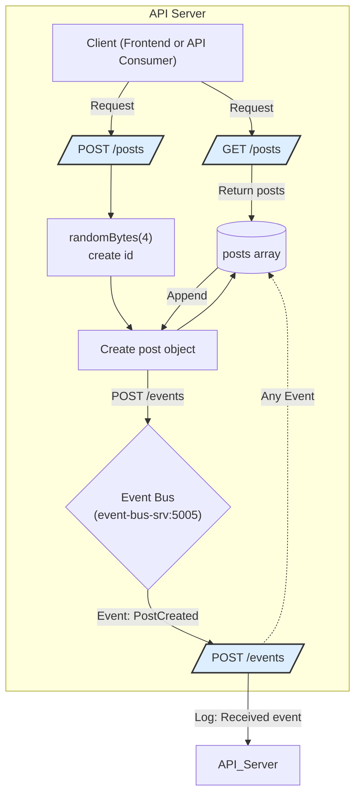

&nbsp;

<SwmSnippet path="/posts/index.js" line="12">

---

posts service has two functionalities: <SwmToken path="/posts/index.js" pos="12:2:2" line-data="app.get(&#39;/posts&#39;, (req, res) =&gt; {">`get`</SwmToken> all posts and add <SwmToken path="/posts/index.js" pos="16:2:2" line-data="app.post(&#39;/posts&#39;, async (req, res) =&gt; {">`post`</SwmToken>

```javascript
app.get('/posts', (req, res) => {
    res.json(posts)
})

app.post('/posts', async (req, res) => {
    const id = randomBytes(4).toString('hex')
    const title = req.body.title
    const post = {
        id: id,
        title
    }
    posts.push(post)

    axios.post('http://event-bus-srv:5005/events',{
        type: 'PostCreated',
        data: post
    }).catch((err) => {
        console.log('Error sending event to event bus: ', err.message)
    });

    res.status(201).json({
        post: post
    })
})
```

---

</SwmSnippet>

Flowchart diagram below to illustrate the main API endpoints and flow within posts service showing how it handles incoming requests and communicates with event-bus.



&nbsp;

<SwmMeta version="3.0.0" repo-id="Z2l0aHViJTNBJTNBYmxvZyUzQSUzQWthaXNhZXRz" repo-name="blog"><sup>Powered by [Swimm](https://app.swimm.io/)</sup></SwmMeta>
